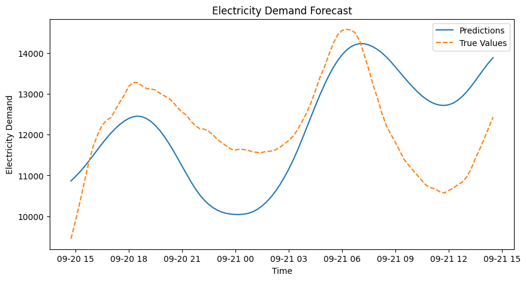

# Electricity Demand Forecaster Netherlands 

Forecasting the national electricity demand of the Netherlands using deep learning (LSTMs) and engineered time-based features.
This project demonstrates time series forecasting, feature engineering, and deployment with FastAPI. 


## Project Overview

- *Goal*: Predict 24h energy demand for the Netherlands 
- *Why*: Accurately predicting the energy demand significantly benefits grid stability which becomes increasingly important due to the growth of renewable energy.
- *Approach*: We train a Long Short-Term Memory (LSTM) on engineered time-based features.  

## Quick Start
### Download dataset 
To train on the complete dataset, download the 15 min database from https://data.open-power-system-data.org/time_series/ and store it in the data/raw folder

### Install requirements
```bash
pip install -r requirements.txt electricitydemandforecaster
```
### Train model
```bash
python edf.train_cli.py --db-path data/raw/time_series.sqlite --table-name time_series_15min_singleindex --config electricitydemandforecaster/configs/base_lstm_minimal.yaml --crossvalidate false --runs-root electricitydemandforecaster/runs --fraction 1
```

### Evaluate model
```python
from edf.evaluate import run_test
run_test('path/to/run', plot_horizons=[1, 96], save_plots=True)
```

## Structure
- `api/` : REST API for serving predictions (FastAPI)
- `electricitydemandforecaster/` : Machine learning codebase 
    - `src/` : Model architecture, feature engineering, training scripts
    - `configs/` : YAML configs for reproducible experiments.
    - `runs/` : Trained models, logs, and metrics.
    - `notebooks/` : Exploratory data analysis and comparison to baseline models (Weekly Naive and XGBoost).
    - `data/`: Folder containing the data. For training, we use 15-minute frequency load data from [Open Power System Data](https://data.open-power-system-data.org/time_series/). A small sample set is included in this repo for illustration. To reproduce experiments, download the full dataset and place it in `data/raw`.

## Model Performance Comparison
In `notebooks/1_training_and_eval`, we benchmark models:

| Model       | MAE  |
|-------------|------|
| XGBoost     | 496  |
| LSTM        | 544  |

Currently, XGBoost outperforms the baseline LSTM, but we are improving the LSTM using CNN-LSTM architectures and adding weather features. Below is an example plot of actual vs. predicted demand:



## Deployment with FastAPI and Docker

### Prerequisites
- Docker

### 1) Build the image
```bash
docker build -t edf-nl .
```

### 2) Serve the API
```bash
docker run --rm -p 8000:8000 edf-nl
```

### 3) Check FastAPI
Go to `127.0.0.1:8000/docs` to access API

### 4) Example API Call
```bash
curl -X 'POST' \
  'http://127.0.0.1:8000/predict' \
  -H 'accept: application/json' \
  -H 'Content-Type: application/json' \
  -d '{
  "run_id": "2025-09-05_07-07-46",
  "timestamp": "2020-08-22T14:30:00"
}'
```


## Roadmap
- Incorporate weather features
- Extend model with CNN layer(s)


